# EdgeTX Dashboards

Generate validated EdgeTX Lua dashboards for color LCD radios from a plain-language description. Get a live WASM radio preview, a visual layout editor, and an SD-card install zip.

**Default radio:** RadioMaster TX15 (480×320 full-screen widgets).  
**Telemetry:** Betaflight, Rotorflight, and generic CRSF.  
**Optional extras:** companion Tool / Telemetry scripts (battery selector, flight logger, and more).

<p align="center">
  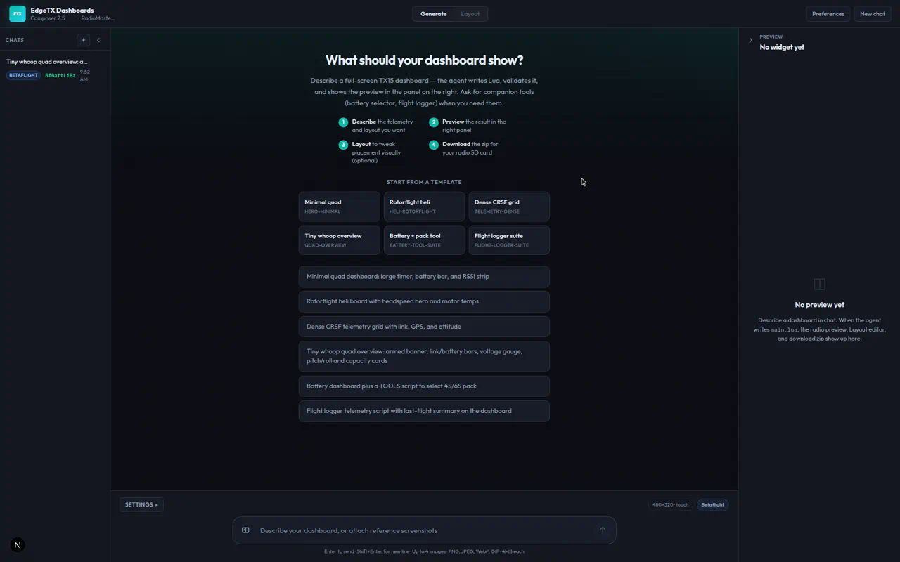
</p>

<p align="center">
  <sub>Generate · Dark theme · template gallery with live board thumbs</sub>
</p>

## Highlights

- **Describe → Preview → Layout → Download** in one product shell
- Cursor agent writes `main.lua` (and optional companion scripts) against real EdgeTX rules
- In-browser **EdgeTX TX15 WASM** preview with mock CRSF telemetry
- Visual **Layout** editor: layers, properties, multi-select, telemetry bind, Insert prefabs with preview thumbs, sim verify
- **Thirteen UI themes** (LCD canvas stays dark in every theme)
- **Preferences → AI** for a browser Cursor API key or server `CURSOR_API_KEY`
- Desktop installers for **Windows / macOS / Linux** (manual Actions workflow)

## Tour

### Generate

Chat to describe layout, sensors, and style. Start from a template (each card shows a TX15 preview PNG) or type freely. The agent validates Lua before packaging, then streams a live preview in the right panel.

Attach reference screenshots to prompts (PNG, JPEG, WebP, GIF; up to 4 images, 4 MB each).

<p align="center">
  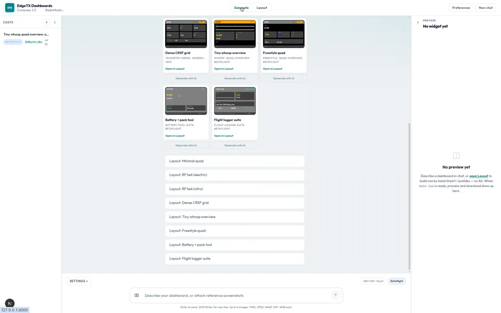
</p>

<p align="center">
  <sub>Template gallery · PNG board thumbs</sub>
</p>

<p align="center">
  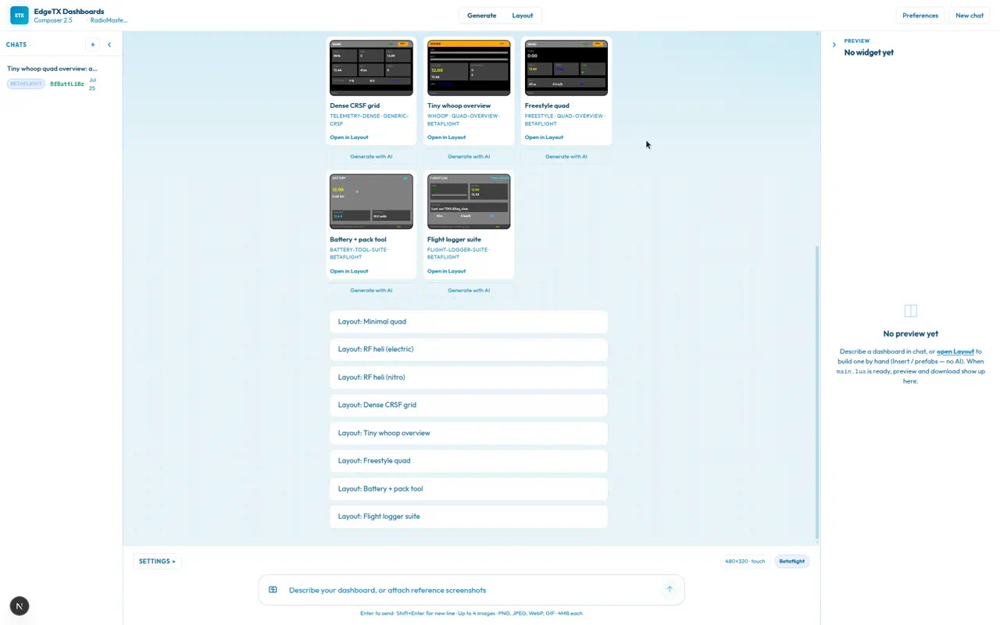
  &nbsp;
  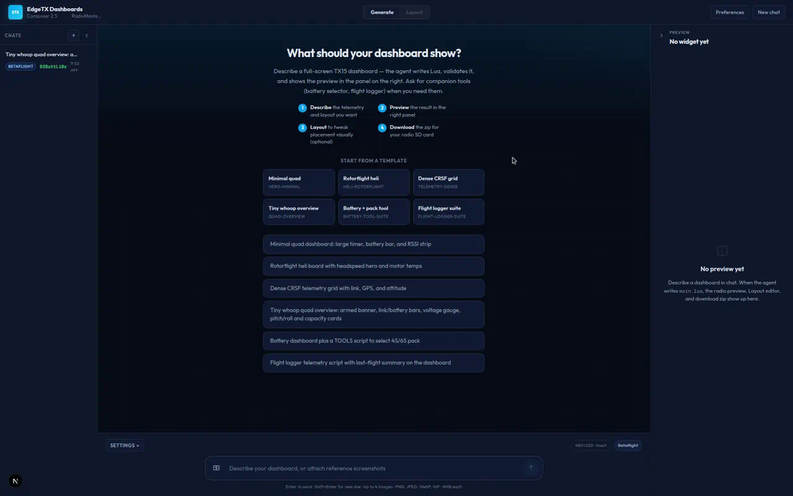
</p>

<p align="center">
  <sub>Ocean · Midnight</sub>
</p>

<p align="center">
  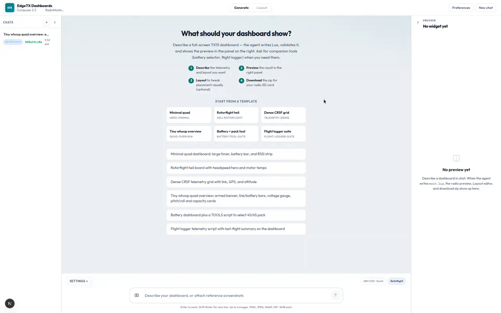
  &nbsp;
  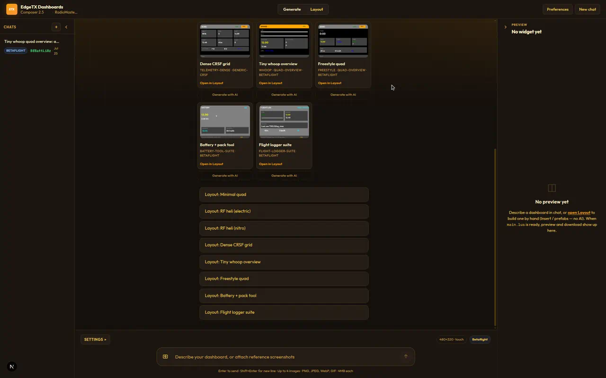
</p>

<p align="center">
  <sub>Light · Ember</sub>
</p>

### Layout editor

Open **Layout** (or `/editor`) to nudge, resize, bind telemetry, insert draw objects / prefab sections, and verify on the dark LCD canvas. Gallery templates open complete boards (whoop, freestyle, RF heli, and more).

<p align="center">
  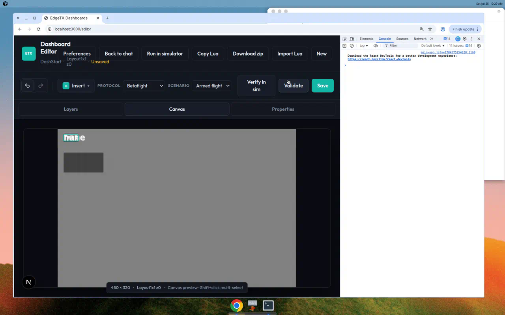
</p>

<p align="center">
  <sub>Layout · Dark · whoop board</sub>
</p>

<p align="center">
  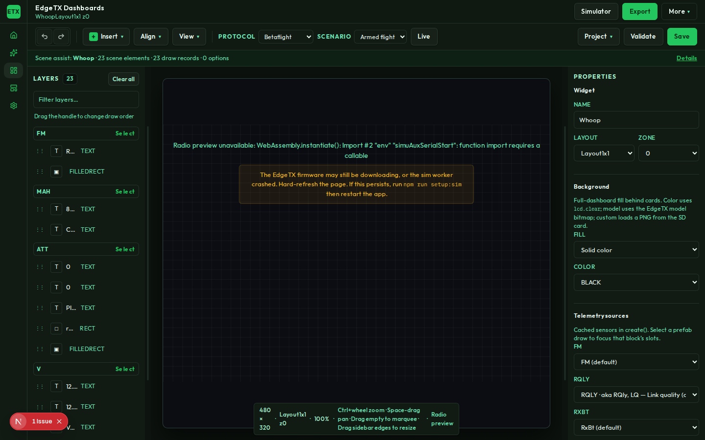
  &nbsp;
  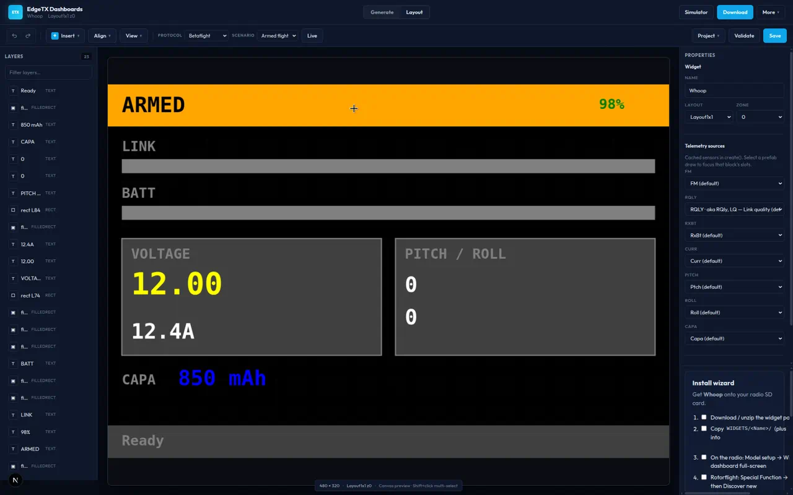
</p>

<p align="center">
  <sub>Forest · Midnight</sub>
</p>

<p align="center">
  
  &nbsp;
  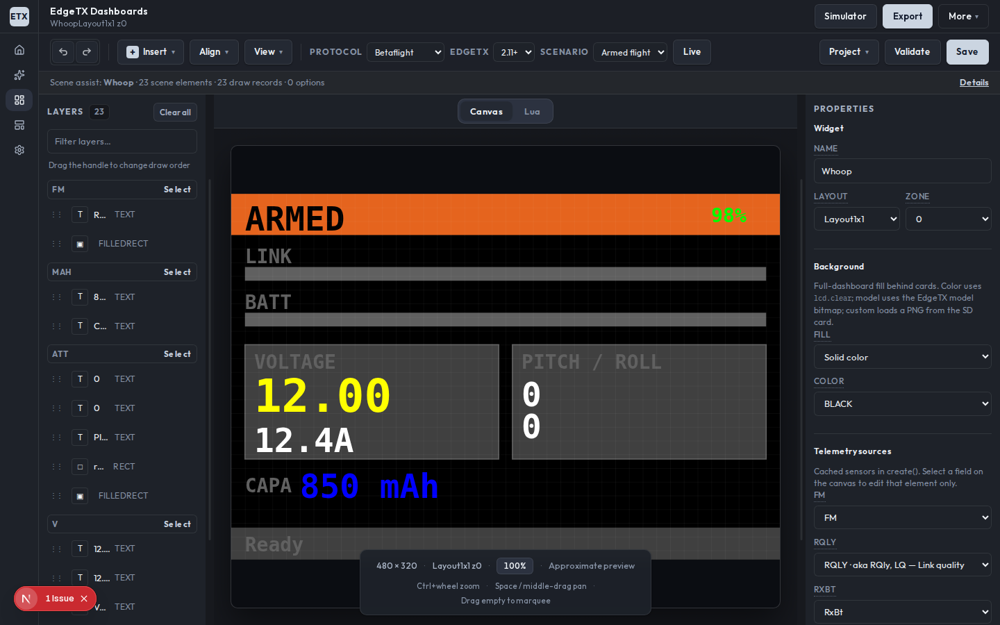
</p>

<p align="center">
  <sub>Light · Slate</sub>
</p>

### Insert prefabs

**Insert** lists modular Rotorflight and Betaflight / CRSF sections with cropped PNG previews, plus full-board actions (whoop, freestyle, dense CRSF, RF heli electric/nitro).

<p align="center">
  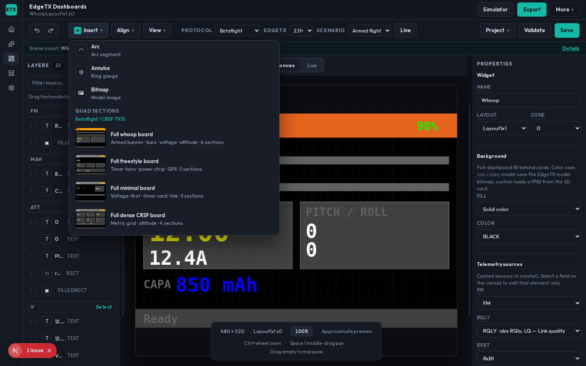
</p>

<p align="center">
  <sub>Insert · Quad sections</sub>
</p>

<p align="center">
  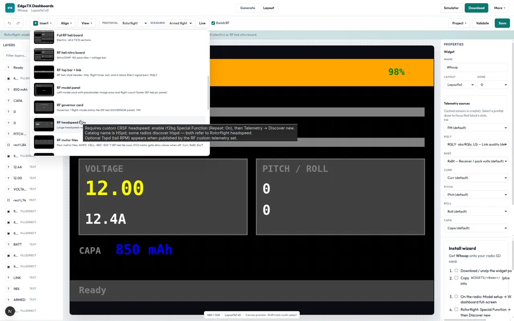
</p>

<p align="center">
  <sub>Insert · Rotorflight sections</sub>
</p>

### Themes

**Preferences → Appearance** ships thirteen themes: Light, Dark, Midnight, Slate, Forest, Ocean, High contrast, Graphite, Meadow, Fog, Ember, Volt, and Copper. Themes apply across Generate and Layout. The radio LCD canvas stays dark everywhere.

<p align="center">
  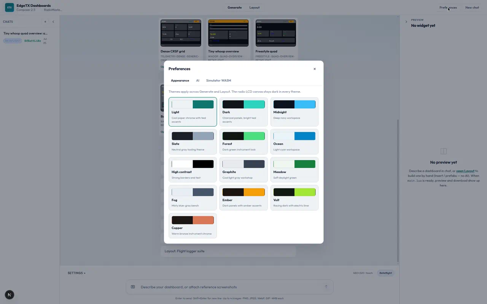
</p>

### AI settings

**Preferences → AI** configures generation without editing env files:

- Optional browser Cursor API key (session storage by default; optional remember-on-device)
- Preferred default model
- Status for server key vs browser key

You can still set `CURSOR_API_KEY` on the server. A browser key overrides it per request via the `x-cursor-api-key` header (never stored in chat history).

<p align="center">
  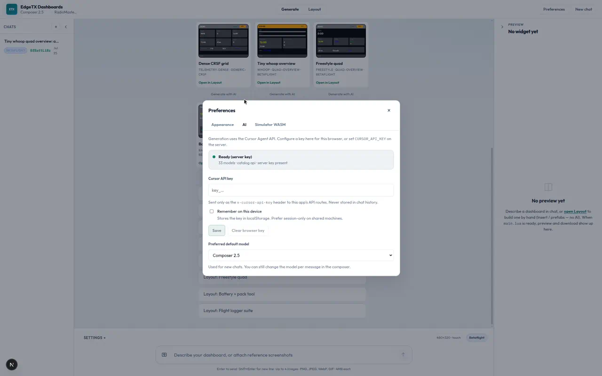
</p>

### Simulator firmware (WASM)

**Preferences → Simulator WASM** downloads about 5 MB of EdgeTX TX15 firmware for the in-browser radio preview. The same assets are fetched by `npm run setup` / `npm run sync-wasm`.

<p align="center">
  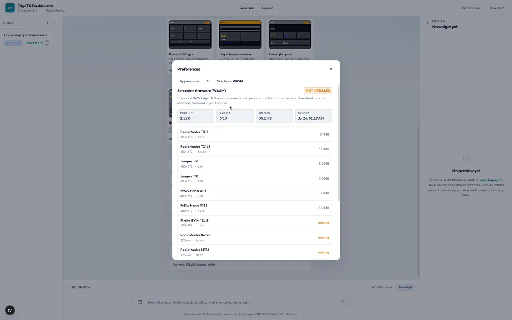
</p>

### Run in simulator

From Layout, **Simulator** boots the WASM preview with the same mock telemetry as the canvas. Use **Open interactive sim** for touch, keys, and sticks (Esc to close).

<p align="center">
  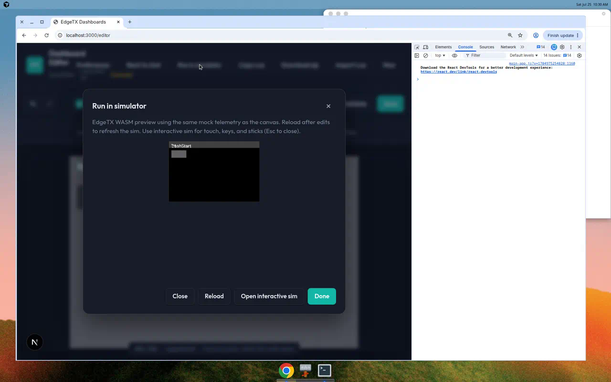
</p>

## What you get

1. Chat to describe layout, sensors, colors, and options
2. An agent that writes `main.lua` (and optional companion scripts)
3. Validation against EdgeTX rules and your telemetry protocol
4. A **Preview** that runs real EdgeTX firmware in the browser (WASM)
5. A visual **Layout** editor for fine-tuning draw objects
6. A **Download** zip with `INSTALL.md` for the radio SD card
7. Optional **desktop** builds (Windows / Linux / macOS) via Tauri 2

## Quick start

**You need:** Node.js **22.13+** and a [Cursor API key](https://cursor.com/dashboard/integrations). Either export `CURSOR_API_KEY`, or add the key later under **Preferences → AI**.

```bash
npm install
npm run setup    # stubs, WASM firmware, simulator patch (first time)
export CURSOR_API_KEY="cursor_..."   # PowerShell: $env:CURSOR_API_KEY="cursor_..."
npm run dev
```

Open [http://localhost:3000](http://localhost:3000), describe a dashboard, wait for the agent to finish, then check the preview.

The first WASM preview load is about 5 MB of EdgeTX firmware (cached afterward). Manage it under **Preferences → Simulator WASM**.

## Using the web UI

| Area            | What it does                                              |
| --------------- | --------------------------------------------------------- |
| **Chats**       | Past conversations                                        |
| **Generate**    | Prompt, radio / protocol / version, generation stream     |
| **Preview**     | Live EdgeTX WASM render + mock CRSF telemetry             |
| **Layout**      | Visual editor (`/editor`): layers, properties, sim verify |
| **Preferences** | Themes, AI API key / model, simulator firmware download   |
| **Download**    | SD-card zip (blocked until validation passes)             |

## Desktop app (Tauri)

```bash
npm run desktop:dev       # Next.js + native window
npm run desktop:prepare   # Next standalone + WASM for packaging
npm run desktop:build     # Native installer (needs platform toolchains)
```

Desktop packages are built **manually** from **Actions → Desktop packages → Run workflow** (not on every merge to `main`). Each green run uploads installers under **Actions → Artifacts** (`edgetx-dashboards-<os>`), and can refresh the `desktop-nightly` prerelease. Push a `desktop-v*` tag for a stable release.

See [desktop docs](docs/reference/desktop-tauri.md). Release sidecars currently expect Node 22+ on PATH (or `EDGETX_NODE_PATH`).

## Put it on your radio

1. Download the zip from the app
2. Copy `WIDGETS/<WidgetName>/` to your SD card
3. On the radio: **Model → Telemetry → Discover new** (power the FC / receiver first)
4. Add the widget to your main view, then go **full screen** (double-tap on TX15)
5. Read `INSTALL.md` in the zip for protocol-specific notes (Rotorflight needs `rf2bg`, etc.)

## CLI (optional)

```bash
export CURSOR_API_KEY="cursor_..."
npm run generate -- --protocol betaflight "Full-screen battery and GPS dashboard"
```

Useful flags: `--radio tx15`, `--protocol betaflight|rotorflight|generic-crsf`, `--edge-tx 2.11.0`.

## Telemetry protocols

| Protocol     | Catalog                                     | Notes                              |
| ------------ | ------------------------------------------- | ---------------------------------- |
| Betaflight   | `knowledge/telemetry/betaflight-crsf.json`  | Standard CRSF via ELRS / Crossfire |
| Rotorflight  | `knowledge/telemetry/rotorflight-crsf.json` | Needs `rf2bg` for custom sensors   |
| Generic CRSF | `knowledge/telemetry/generic-crsf.json`     | Common ELRS / CRSF sensor names    |

## Validation

Nothing ships until the widget passes checks:

- Widget structure (`name`, `create`, `refresh`, no `require` / `dofile`)
- Sensor names match the protocol catalog
- EdgeTX LCD API rules (including dev-kit stubs)
- Agent must get `valid: true` from `validateWidget` before packaging

Failed validation blocks download (HTTP 422). Fix in chat or the layout editor, then try again.

## If preview or sim breaks

| Symptom                              | Try this                                               |
| ------------------------------------ | ------------------------------------------------------ |
| Stuck on "Booting EdgeTX preview..." | Restart `npm run dev`, hard-refresh the browser        |
| WASM 404 / Preferences incomplete    | `npm run sync-wasm` or Preferences → Download firmware |
| `simuAuxSerialStart` errors          | `npm run setup:sim`, restart dev server                |
| After changing `packages/*`          | Restart the dev server (packages compile from source)  |

## Project layout

```
apps/web/               Next.js UI and API routes
apps/desktop/           Tauri 2 desktop shell + standalone sidecar
packages/generator/     Cursor SDK agent, validation, packaging
packages/shared/        Shared types and @simulate layouts
packages/sim-preview/   EdgeTX WASM runtime and telemetry bridge
packages/layout-verify/ Static Lua draw interpreter and overlap checks
packages/editor-core/   Lua document model behind the visual editor
knowledge/              Radio profiles, telemetry catalogs, design guides
templates/              Starter Lua and INSTALL.md template
examples/               Reference widgets
apps/web/public/sim/    EdgeTX WASM firmware (auto-fetched)
generated/              Agent output (gitignored)
```

Packages are consumed as TypeScript source. Only the web app (and desktop packaging) have a build step.

More detail: [docs/README.md](docs/README.md) · [workspace layout](docs/reference/workspace-layout.md) · [scripts](docs/reference/scripts.md)

## Environment variables

| Variable               | Required | Description                                          |
| ---------------------- | -------- | ---------------------------------------------------- |
| `CURSOR_API_KEY`       | Yes*     | Cursor API key for generation (*or Preferences → AI) |
| `ANTHROPIC_API_KEY`    | No*      | Anthropic key when provider is Anthropic             |
| `OPENAI_API_KEY`       | No*      | OpenAI key when provider is OpenAI                   |
| `GEMINI_API_KEY`       | No*      | Gemini key when provider is Gemini                   |
| `GENERATOR_API_SECRET` | No       | Protects API routes when set                         |
| `SKIP_WASM_SYNC`       | No       | Set to `1` to skip WASM download on install/dev      |
| `WIDGET_GEN_DATA_DIR`  | No       | Override data dir (desktop sidecar uses app data)    |
| `EDGETX_NODE_PATH`     | No       | Node binary for desktop release sidecar              |

## License

MIT. See [LICENSE](LICENSE).
