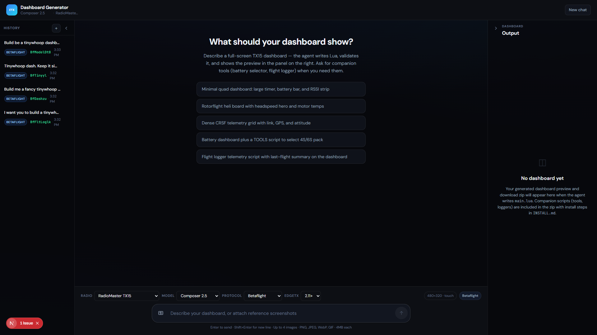
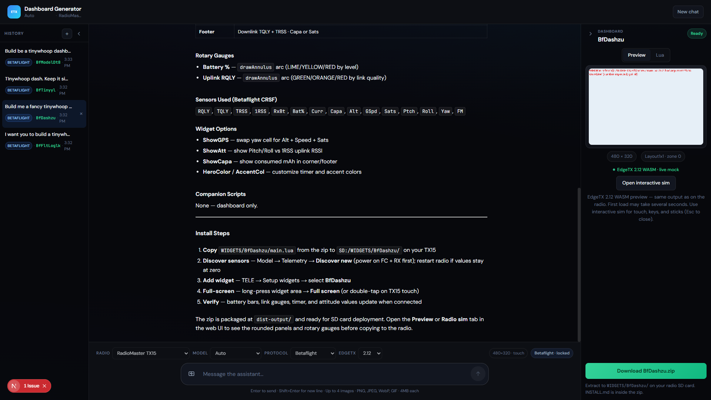

# EdgeTX Dashboard Generator

Describe the dashboard you want. The app writes the Lua, checks it, shows a live preview on a virtual TX15, and gives you a zip to copy to your radio SD card.

Built for full-screen widgets on color LCD radios (default: **RadioMaster TX15**, 480×320). Works with **Betaflight**, **Rotorflight**, and **generic CRSF** telemetry. You can also ask for companion **Tool** or **Telemetry** scripts (battery selector, flight logger, and similar).





## What you get

1. A chat where you describe layout, sensors, colors, and options
2. An agent that writes `main.lua` (and optional companion scripts)
3. Validation against EdgeTX rules and your telemetry protocol
4. A **Preview** panel that runs real EdgeTX firmware in the browser (WASM), not a fake canvas
5. A **Download** button with `INSTALL.md` inside the zip

Pick your radio, protocol, and EdgeTX version in the composer bar. Refine in chat until it looks right, then download.

## Quick start

**You need:** Node.js **22.13+** and a [Cursor API key](https://cursor.com/dashboard/integrations) (`CURSOR_API_KEY`).

```bash
npm install
npm run setup    # stubs, WASM firmware, simulator patch (first time)
export CURSOR_API_KEY="cursor_..."   # PowerShell: $env:CURSOR_API_KEY="cursor_..."
npm run dev
```

Open [http://localhost:3000](http://localhost:3000), describe a dashboard, wait for the agent to finish, then check the preview on the right.

The first WASM preview load downloads about 5 MB of EdgeTX firmware. Your browser caches it after that.

## Using the web UI

**History** on the left keeps past chats. **Output** on the right shows:

- **Preview**: live EdgeTX WASM render of your widget (mock CRSF telemetry ticks every few seconds)
- **Lua**: the generated source
- **Open interactive sim**: full radio overlay with touch, keys, and sticks (Esc to close)
- **Download**: zip for your SD card (blocked until validation passes)

You can attach reference screenshots to your prompt (PNG, JPEG, WebP, GIF, up to 4 MB each).

## Put it on your radio

1. Download the zip from the app
2. Copy `WIDGETS/<WidgetName>/` to your SD card
3. On the radio: **Model → Telemetry → Discover new** (power the FC/receiver first)
4. Add the widget to your main view, then go **full screen** (double-tap on TX15)
5. Read `INSTALL.md` in the zip for protocol-specific notes (Rotorflight needs `rf2bg`, etc.)

## CLI (optional)

```bash
export CURSOR_API_KEY="cursor_..."
npm run generate -- --protocol betaflight "Full-screen battery and GPS dashboard"
```

Useful flags: `--radio tx15`, `--protocol betaflight|rotorflight|generic-crsf`, `--edge-tx 2.11.0`.

## Telemetry protocols

| Protocol | Catalog | Notes |
|----------|---------|-------|
| Betaflight | `knowledge/telemetry/betaflight-crsf.json` | Standard CRSF via ELRS / Crossfire |
| Rotorflight | `knowledge/telemetry/rotorflight-crsf.json` | Needs `rf2bg` for custom sensors |
| Generic CRSF | `knowledge/telemetry/generic-crsf.json` | Common ELRS / CRSF sensor names |

## Validation

Nothing ships until the widget passes checks:

- Widget structure (`name`, `create`, `refresh`, no `require` / `dofile`)
- Sensor names match the protocol catalog
- EdgeTX LCD API rules (including dev-kit stubs)
- Agent must get `valid: true` from `validateWidget` before packaging

Failed validation blocks download (HTTP 422). Fix issues in chat or edit the Lua, then try again.

## If preview or sim breaks

| Symptom | Try this |
|---------|----------|
| Stuck on “Booting EdgeTX preview…” | Restart `npm run dev`, hard-refresh the browser |
| WASM 404 | `npm run sync-wasm` or `npm run setup:sim` |
| `simuAuxSerialStart` errors | `npm run setup:sim`, restart dev server |
| After changing `packages/sim-preview` | Restart dev server (packages are compiled from source) |

## VS Code / EdgeTX Dev Kit

For local script debugging outside the web app:

1. Install **Lua** + **EdgeTX Dev Kit** (see `.vscode/extensions.json`)
2. Open generated `main.lua` (annotations are injected automatically):

   ```lua
   ---@type WidgetScript
   ---@simulate Layout1x1 zone=0
   ```

3. Run **EdgeTX: Simulate Script** or **Watch Script**

## Project layout

```
apps/web/              Next.js UI and API routes
packages/generator/    Cursor SDK agent, validation, packaging
packages/shared/       Shared types and @simulate layouts
packages/sim-preview/  EdgeTX WASM runtime and telemetry bridge
packages/layout-verify/ Static Lua draw interpreter and overlap checks
packages/editor-core/  Lua <-> scene model behind the visual editor
knowledge/             Radio profiles, telemetry catalogs, design guides
templates/             Starter Lua and INSTALL.md template
examples/              Reference widgets
apps/web/public/sim/   EdgeTX WASM firmware (auto-fetched on install)
generated/             Agent output (gitignored)
```

Packages are consumed as TypeScript source, so only the web app has a build step.
More detail in [docs/reference/workspace-layout.md](docs/reference/workspace-layout.md)
and [docs/reference/scripts.md](docs/reference/scripts.md).

## Environment variables

| Variable | Required | Description |
|----------|----------|-------------|
| `CURSOR_API_KEY` | Yes | Cursor API key for generation |
| `GENERATOR_API_SECRET` | No | Protects API routes when set |
| `SKIP_WASM_SYNC` | No | Set to `1` to skip WASM download on install |

## License

MIT. See [LICENSE](LICENSE).
