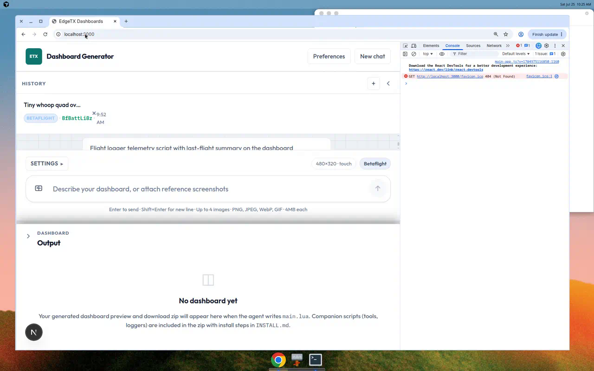
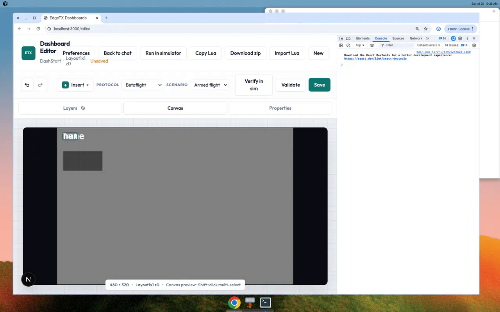

# EdgeTX Dashboards

Describe a TX15 dashboard in plain language — get validated Lua, a live EdgeTX WASM preview, a visual layout editor, and an SD-card zip.

Built for full-screen widgets on color LCD radios (default **RadioMaster TX15**, 480×320). Supports **Betaflight**, **Rotorflight**, and **generic CRSF**. Optional companion **Tool** / **Telemetry** scripts (battery selector, flight logger, and more).

<p align="center">
  
</p>

## Tour

### Generate

Chat to describe layout, sensors, and style. The agent writes `main.lua`, validates it, and streams a live preview (see hero screenshot above).

### Layout editor

Open **Edit layout** (or `/editor`) to nudge, resize, bind telemetry, and tweak draw objects on a dark LCD canvas with a light instrument chrome.

<p align="center">
  
</p>

### Themes

**Preferences → Appearance** ships seven themes (Light, Dark, Midnight, Slate, Forest, Ocean, High contrast). The radio LCD canvas stays dark in every theme.

<p align="center">
  
</p>

<p align="center">
  
</p>

### Simulator firmware (WASM)

**Preferences → Simulator WASM** downloads ~5 MB EdgeTX TX15 firmware for the in-browser radio preview (also auto-fetched on `npm run setup` / `npm run sync-wasm`).

<p align="center">
  
</p>

### Run in simulator

From the editor, **Run in simulator** boots the same WASM preview with mock telemetry. Use **Open interactive sim** for touch, keys, and sticks.

<p align="center">
  
</p>

## What you get

1. Chat to describe layout, sensors, colors, and options
2. An agent that writes `main.lua` (and optional companion scripts)
3. Validation against EdgeTX rules and your telemetry protocol
4. A **Preview** that runs real EdgeTX firmware in the browser (WASM)
5. A visual **Layout** editor for fine-tuning draw objects
6. A **Download** zip with `INSTALL.md` for the radio SD card
7. Optional **desktop** builds (Windows / Linux / macOS) via Tauri 2

## Quick start

**You need:** Node.js **22.13+** and a [Cursor API key](https://cursor.com/dashboard/integrations) (`CURSOR_API_KEY`).

```bash
npm install
npm run setup    # stubs, WASM firmware, simulator patch (first time)
export CURSOR_API_KEY="cursor_..."   # PowerShell: $env:CURSOR_API_KEY="cursor_..."
npm run dev
```

Open [http://localhost:3000](http://localhost:3000), describe a dashboard, wait for the agent to finish, then check the preview.

The first WASM preview load is about 5 MB of EdgeTX firmware (cached afterward). You can also manage it under **Preferences → Simulator WASM**.

## Using the web UI

| Area            | What it does                                               |
| --------------- | ---------------------------------------------------------- |
| **Chats**       | Past conversations                                         |
| **Generate**    | Prompt, radio/protocol/version, generation stream          |
| **Preview**     | Live EdgeTX WASM render + mock CRSF telemetry              |
| **Layout**      | Visual editor (`/editor`) — layers, properties, sim verify |
| **Preferences** | Themes + simulator firmware download                       |
| **Download**    | SD-card zip (blocked until validation passes)              |

Attach reference screenshots to prompts (PNG, JPEG, WebP, GIF, up to 4 MB each).

## Desktop app (Tauri)

```bash
npm run desktop:dev       # Next.js + native window
npm run desktop:prepare   # Next standalone + WASM for packaging
npm run desktop:build     # Native installer (needs platform toolchains)
```

Merges to `main` build Windows, Linux, and macOS packages in CI (see [desktop docs](docs/reference/desktop-tauri.md)). Release sidecars currently expect Node 22+ on PATH (or `EDGETX_NODE_PATH`).

## Put it on your radio

1. Download the zip from the app
2. Copy `WIDGETS/<WidgetName>/` to your SD card
3. On the radio: **Model → Telemetry → Discover new** (power the FC/receiver first)
4. Add the widget to your main view, then go **full screen** (double-tap on TX15)
5. Read `INSTALL.md` in the zip for protocol-specific notes (Rotorflight needs `rf2bg`, etc.)

## CLI (optional)

```bash
export CURSOR_API_KEY="cursor_..."
npm run generate -- --protocol betaflight "Full-screen battery and GPS dashboard"
```

Useful flags: `--radio tx15`, `--protocol betaflight|rotorflight|generic-crsf`, `--edge-tx 2.11.0`.

## Telemetry protocols

| Protocol     | Catalog                                     | Notes                              |
| ------------ | ------------------------------------------- | ---------------------------------- |
| Betaflight   | `knowledge/telemetry/betaflight-crsf.json`  | Standard CRSF via ELRS / Crossfire |
| Rotorflight  | `knowledge/telemetry/rotorflight-crsf.json` | Needs `rf2bg` for custom sensors   |
| Generic CRSF | `knowledge/telemetry/generic-crsf.json`     | Common ELRS / CRSF sensor names    |

## Validation

Nothing ships until the widget passes checks:

- Widget structure (`name`, `create`, `refresh`, no `require` / `dofile`)
- Sensor names match the protocol catalog
- EdgeTX LCD API rules (including dev-kit stubs)
- Agent must get `valid: true` from `validateWidget` before packaging

Failed validation blocks download (HTTP 422). Fix in chat or the layout editor, then try again.

## If preview or sim breaks

| Symptom                            | Try this                                               |
| ---------------------------------- | ------------------------------------------------------ |
| Stuck on “Booting EdgeTX preview…” | Restart `npm run dev`, hard-refresh the browser        |
| WASM 404 / Preferences incomplete  | `npm run sync-wasm` or Preferences → Download firmware |
| `simuAuxSerialStart` errors        | `npm run setup:sim`, restart dev server                |
| After changing `packages/*`        | Restart dev server (packages compile from source)      |

## Project layout

```
apps/web/               Next.js UI and API routes
apps/desktop/           Tauri 2 desktop shell + standalone sidecar
packages/generator/     Cursor SDK agent, validation, packaging
packages/shared/        Shared types and @simulate layouts
packages/sim-preview/   EdgeTX WASM runtime and telemetry bridge
packages/layout-verify/ Static Lua draw interpreter and overlap checks
packages/editor-core/   Lua document model behind the visual editor
knowledge/              Radio profiles, telemetry catalogs, design guides
templates/              Starter Lua and INSTALL.md template
examples/               Reference widgets
apps/web/public/sim/    EdgeTX WASM firmware (auto-fetched)
generated/              Agent output (gitignored)
```

Packages are consumed as TypeScript source — only the web app (and desktop packaging) have a build step.  
More detail: [docs/README.md](docs/README.md) · [workspace layout](docs/reference/workspace-layout.md) · [scripts](docs/reference/scripts.md)

## Environment variables

| Variable               | Required | Description                                       |
| ---------------------- | -------- | ------------------------------------------------- |
| `CURSOR_API_KEY`       | Yes*     | Cursor API key for generation (*web generate)     |
| `GENERATOR_API_SECRET` | No       | Protects API routes when set                      |
| `SKIP_WASM_SYNC`       | No       | Set to `1` to skip WASM download on install/dev   |
| `WIDGET_GEN_DATA_DIR`  | No       | Override data dir (desktop sidecar uses app data) |
| `EDGETX_NODE_PATH`     | No       | Node binary for desktop release sidecar           |

## License

MIT. See [LICENSE](LICENSE).
