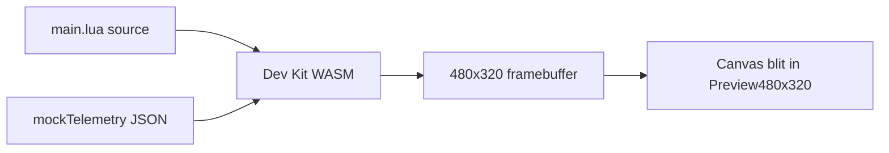

# WASM Runtime Preview — Feasibility Spike

**Status:** Research spike (Phase 4 of Accurate Radio Preview plan)  
**Date:** 2026-07-05

## Problem

The web preview (`apps/web/src/lib/luaPreviewEngine.ts`) regex-parses `lcd.*` calls in `refresh()` and evaluates layout math with a partial JavaScript subset. It is fast and good enough for iteration, but cannot guarantee pixel-accurate parity with EdgeTX on the radio.

## Options

| Approach | Fidelity | Effort | Fits current widgets |
|----------|----------|--------|----------------------|
| **Regex preview (today)** | Approximate | Done | All `lcd.*` dashboards |
| **EdgeTX Dev Kit WASM** | High — real Lua + draw stubs | Large (bundle, telem inject, CI) | All widget scripts |
| **LVGL.js** | High for LVGL only | Large | `useLvgl` widgets only |
| **Headless radio screenshot** | Exact | CI infra only | Post-build verification |

## Recommendation

1. **Keep regex preview** as the default dev loop (fast, no download).
2. **Add optional “Verify in sim”** later: embed [EdgeTX Dev Kit](https://github.com/JeffreyChix/edgetx-dev-kit) WASM in a dedicated panel or modal, fed `main.lua` + mock telemetry JSON.
3. **Do not block generation on WASM** — validation stays in Node (`validateWidgetLua`); preview health warnings surface parser uncertainty in the UI.
4. **LVGL dashboards** remain opt-in with “no web preview” until an LVGL table-literal parser exists (separate from WASM).

## EdgeTX Dev Kit WASM — integration sketch

**Open questions for a follow-up RFC:**

- Bundle size budget (WASM + stubs + fonts).
- Whether to run in a Web Worker to avoid blocking the UI.
- How to stub `getValue()` / `model.getTimer()` from the same mock catalog as `mockTelemetry.ts`.
- Whether `@simulate` zone cropping happens in WASM or in the blit step.

## Out of scope for this spike

- Implementing WASM embed
- LVGL preview renderer
- Replacing the regex engine entirely

## Success criteria for a future implementation

- BfModelDt8 (and golden fixtures) match radio screenshot within 1–2 px for text placement.
- Preview panel offers “Fast preview” (regex) vs “Radio sim” (WASM) tabs.
- CI optional job can fail on WASM-vs-golden diff for release tags.
